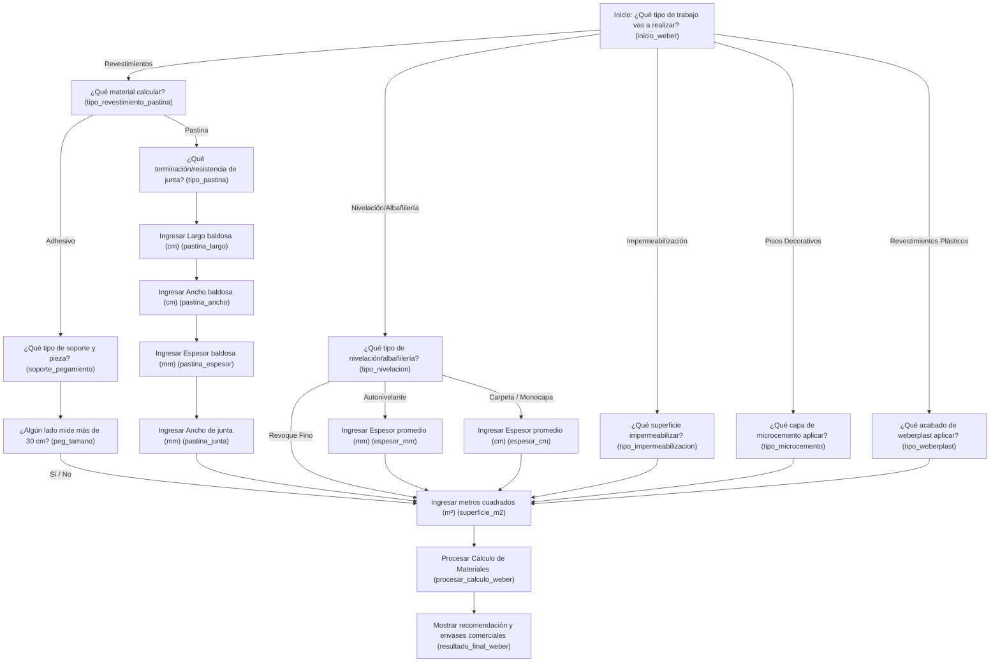

# Mapa del Sistema Experto de Weber (v5.0.2)

Este documento detalla el árbol de decisiones completo, las opciones de ramificación y los algoritmos de cálculo del sistema experto de Weber implementado en la aplicación de **SOLDASUR**.

---

## 🗺️ Diagrama de Flujo del Asesor (Mermaid)

El siguiente gráfico describe el recorrido secuencial de preguntas, entradas y variables del sistema experto para todos los tipos de obra:

---

## 📋 Nodos de la Base de Conocimiento (`advisor_knowledge_base_weber.json`)

### 1. `inicio_weber`
* **Pregunta:** ¿Qué tipo de trabajo vas a realizar en la obra?
* **Opciones:**
  * Colocación de Revestimientos (Cerámicos / Porcelanatos) $\rightarrow$ `tipo_revestimiento_pastina`
  * Nivelación y Albañilería (Carpetas, revoques) $\rightarrow$ `tipo_nivelacion`
  * Impermeabilización de Superficies $\rightarrow$ `tipo_impermeabilizacion`
  * Pisos Decorativos (Microcementos) $\rightarrow$ `tipo_microcemento`
  * Revestimientos Plásticos Decorativos (weberplast) $\rightarrow$ `tipo_weberplast`

### 2. `tipo_revestimiento_pastina`
* **Pregunta:** ¿Qué material necesitás calcular para el revestimiento?
* **Opciones:**
  * Adhesivo (Pegamento) $\rightarrow$ `soporte_pegamiento`
  * Pastina (Tomado de juntas) $\rightarrow$ `tipo_pastina`

### 3. `soporte_pegamiento`
* **Pregunta:** ¿Qué tipo de revestimiento y soporte vas a utilizar?
* **Opciones:**
  * Cerámica Estándar (Carpeta/Revoque tradicional) [ID: `peg_classic`] $\rightarrow$ `peg_tamano`
  * Porcellanatos (Baja absorción) [ID: `peg_flex`] $\rightarrow$ `peg_tamano`
  * Colocación sobre cerámicas existentes [ID: `peg_psp`] $\rightarrow$ `peg_tamano`
  * Vidrio / Venecitas (Baños y piscinas) [ID: `peg_glass`] $\rightarrow$ `peg_tamano`

### 4. `peg_tamano`
* **Pregunta:** ¿Algún lado de la baldosa o pieza de revestimiento mide más de 30 cm?
* **Opciones:**
  * Sí (requiere doble encolado) [Variable `doble_encolado` = `"si"`] $\rightarrow$ `superficie_m2`
  * No (colocación tradicional) [Variable `doble_encolado` = `"no"`] $\rightarrow$ `superficie_m2`

### 5. `tipo_pastina`
* **Pregunta:** ¿Qué tipo de terminación/resistencia necesitás para la junta?
* **Opciones:**
  * Classic (Juntas finas hasta 5mm) [ID: `pastina_classic`] $\rightarrow$ `pastina_largo`
  * Prestige (Porcellanatos y juntas de 2 a 15mm) [ID: `pastina_prestige`] $\rightarrow$ `pastina_largo`
  * Lista para Usar (Acrílica de 1 a 4mm) [ID: `pastina_lista`] $\rightarrow$ `pastina_largo`
  * Epoxi Max (Máxima resistencia e impermeabilidad) [ID: `pastina_epoxi`] $\rightarrow$ `pastina_largo`

### 6. `pastina_largo`, `pastina_ancho`, `pastina_espesor`, `pastina_junta`
* **Entradas numéricas del usuario**:
  * Largo de la baldosa en cm (variable: `pastina_largo`)
  * Ancho de la baldosa en cm (variable: `pastina_ancho`)
  * Espesor de la baldosa en mm (variable: `pastina_espesor`)
  * Ancho de la junta deseada en mm (variable: `pastina_junta`)
  * Todos enrutan secuencialmente hacia $\rightarrow$ `superficie_m2`

### 7. `tipo_nivelacion`
* **Pregunta:** ¿Qué tipo de trabajo de albañilería / regularización vas a hacer?
* **Opciones:**
  * Autonivelante rápido (Capa fina interior) [ID: `autonivelante`] $\rightarrow$ `espesor_mm`
  * Carpeta tradicional de nivelación [ID: `carpeta_tradicional`] $\rightarrow$ `espesor_cm`
  * Revoque Fino exterior/interior [ID: `revoque_fino`] $\rightarrow$ `superficie_m2`
  * Revoque Monocapa (Grueso+Fino liso) [ID: `revoque_monocapa`] $\rightarrow$ `espesor_cm`

### 8. `espesor_mm` / `espesor_cm`
* **Entradas de espesor técnico**:
  * Espesor promedio en mm (variable `espesor_medida`) $\rightarrow$ `superficie_m2`
  * Espesor promedio en cm (variable `espesor_medida`) $\rightarrow$ `superficie_m2`

### 9. `tipo_impermeabilizacion`
* **Pregunta:** ¿Qué tipo de superficie querés proteger de la humedad?
* **Opciones:**
  * Techados / Terrazas / Azoteas expuestas [ID: `imp_techos`] $\rightarrow$ `superficie_m2`
  * Fachadas / Paredes Exteriores [ID: `imp_frentes`] $\rightarrow$ `superficie_m2`
  * Cimientos / Barrera aisladora horizontal [ID: `imp_ceresita`] $\rightarrow$ `superficie_m2`
  * Piscinas / Cisternas / Aljibes [ID: `imp_piscinas`] $\rightarrow$ `superficie_m2`
  * Baños / Cocinas (Bajo revestimiento) [ID: `imp_banio`] $\rightarrow$ `superficie_m2`

### 10. `tipo_microcemento`
* **Pregunta:** ¿Qué capa del sistema de microcemento decorativo vas a colocar?
* **Opciones:**
  * Capa Base niveladora (weber microbase) [ID: `microcemento_base`] $\rightarrow$ `superficie_m2`
  * Capa Color terminación (weber microcolor) [ID: `microcemento_color`] $\rightarrow$ `superficie_m2`

### 11. `tipo_weberplast`
* **Pregunta:** ¿Qué tipo de acabado texturado decorativo (weberplast) vas a aplicar?
* **Opciones:**
  * Textura Fina (Llaneado / Rodillado fino) [ID: `weberplast_fino`] $\rightarrow$ `superficie_m2`
  * Textura Media (Rulato / Travertino medio) [ID: `weberplast_medio`] $\rightarrow$ `superficie_m2`
  * Textura Gruesa (Acabado rústico grueso) [ID: `weberplast_grueso`] $\rightarrow$ `superficie_m2`

### 12. `superficie_m2`
* **Entrada final**: Superficie total en m² (variable `metros_cuadrados`) $\rightarrow$ `procesar_calculo_weber`

---

## ⚙️ Lógica de Cálculo y Rendimientos (`expert_engine_weber.py`)

El motor de cálculo busca el soporte de obra seleccionado en el diccionario de rendimientos estáticos para realizar el cómputo exacto:

| Categoría | Soporte/Producto (`soporte_obra`) | Nombre Comercial Comercializado | Rendimiento Base | Unidad de Medida |
| :--- | :--- | :--- | :---: | :---: |
| **Adhesivos** | `peg_classic` | Weber gris cerámicos | 5.0 | $kg/m^2$ |
| | `peg_flex` | Weber flex porcellanato | 5.0 | $kg/m^2$ |
| | `peg_psp` | Weber piso sobre piso 12hs | 6.0 | $kg/m^2$ |
| | `peg_glass` | Weber glass | 4.5 | $kg/m^2$ |
| **Pastinas** | `pastina_classic` | Weber pastina classic | *Especial* | Densidad: 1.60 |
| | `pastina_prestige` | Weber pastina prestige | *Especial* | Densidad: 1.65 |
| | `pastina_lista` | Weber pastina lista | *Especial* | Densidad: 1.50 |
| | `pastina_epoxi` | Weber pastina epoxi max | *Especial* | Densidad: 1.80 |
| **Nivelación**| `autonivelante` | Weber autonivela | 1.6 | $kg/m^2$ por mm de espesor |
| | `carpeta_tradicional` | Weber carpeta | 20.0 | $kg/m^2$ por cm de espesor |
| | `revoque_fino` | Weber fino | 3.0 | $kg/m^2$ (fijo) |
| | `revoque_monocapa` | Weber monocapa prisma | 15.0 | $kg/m^2$ por cm de espesor |
| **Impermeabil.**| `imp_techos` | Weberdry techos con poliuretano | 1.5 | $kg/m^2$ (fijo) |
| | `imp_frentes` | Weberdry frentes y muros | 0.8 | $kg/m^2$ (fijo) |
| | `imp_ceresita` | Webertec ceresita | 1.5 | $kg/m^2$ (fijo) |
| | `imp_piscinas` | Weber piscinas | 2.5 | $kg/m^2$ (fijo) |
| | `imp_banio` | Weber impermeable cerámicos con ceresita | 1.5 | $kg/m^2$ (fijo) |
| **Microcemento**| `microcemento_base` | Weber microbase | 2.0 | $kg/m^2$ (fijo) * |
| | `microcemento_color` | Weber microcolor | 1.0 | $kg/m^2$ (fijo) * |
| **Weberplast** | `weberplast_fino` | Weberplast llaneado | 1.6 | $kg/m^2$ (fijo) |
| | `weberplast_medio` | Weberplast rulato travertino medio | 2.2 | $kg/m^2$ (fijo) |
| | `weberplast_grueso` | Weberplast rulato travertino grueso | 3.2 | $kg/m^2$ (fijo) |

*\* Nota: Los productos de microcemento son bicomponentes. Requieren un producto auxiliar (`weber emulsión`) calculado con un factor de `1/3` para la base y `1/2` para el color respectivamente.*

---

## 🧮 Fórmulas Matemáticas de Cómputo

### 1. Adhesivos (Pegamentos)
Si el usuario selecciona doble encolado (`doble_encolado == "si"`), se adicionan **2.0 kg/m²** de consumo técnico por especificación de colocación en piezas grandes:
$$\text{Rendimiento Ajustado} = \text{Rendimiento Base} + (\text{2.0 si doble encolado, 0.0 de lo contrario})$$
$$\text{Kg Requeridos} = \text{Superficie (m²)} \times \text{Rendimiento Ajustado}$$

### 2. Pastinas (Fórmula Física de Consumo de Juntas)
El cálculo del consumo de pastina por metro cuadrado se realiza mediante la siguiente ecuación volumétrica:
$$\text{Consumo Base (kg/m²)} = \frac{(\text{Largo} + \text{Ancho}) \times \text{Espesor} \times \text{Junta} \times \text{Densidad}}{(\text{Largo} \times \text{Ancho}) \times 10}$$
*Donde: Largo y Ancho están en cm; Espesor y Junta están en mm; Densidad está especificada en la tabla.*
$$\text{Kg Requeridos} = \text{Superficie (m²)} \times \text{Consumo Base (kg/m²)}$$

### 3. Nivelación / Albañilería con Espesores variables
* **Autonivelante (espesor en mm)**:
  $$\text{Kg Requeridos} = \text{Superficie (m²)} \times \text{Espesor (mm)} \times 1.6$$
* **Carpeta o Monocapa (espesor en cm)**:
  $$\text{Kg Requeridos} = \text{Superficie (m²)} \times \text{Espesor (cm)} \times \text{Rendimiento Base}$$

---

### Desperdicio y Empaque Comercial

Para garantizar que el cliente no se quede sin material debido a recortes o irregularidades del suelo, el motor experto aplica las siguientes reglas de cierre:

1. **Margen de Desperdicio Obligatorio (10%)**:
   $$\text{Kg Totales} = \text{Kg Requeridos} \times 1.10$$

2. **Cómputo de Envases Comerciales (Bolsas o Tachos)**:
   * **Adhesivos / Nivelación / Revestimientos**: Se comercializan en bolsas o tachos de **25 kg**. Se redondea siempre al entero superior:
     $$\text{Cantidad Bolsas} = \text{ceil}\left(\frac{\text{Kg Totales}}{25}\right)$$
   * **Pastinas**: Se comercializan en potes o bolsas de **2 kg** (excepto Epoxi Max que viene en kit de **5 kg**). Se redondea al envase superior:
     $$\text{Cantidad Envases} = \text{ceil}\left(\frac{\text{Kg Totales}}{\text{Peso Envase}}\right)$$
