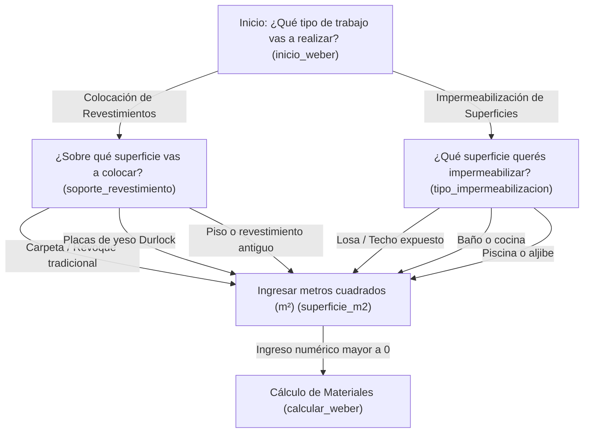

# Mapa del Sistema Experto de Weber

Este documento detalla el árbol de decisiones y el flujo de cálculo del sistema experto de Weber implementado en la aplicación de **SOLDASUR**.

## 🗺️ Diagrama de Flujo del Asesor (Mermaid)

El siguiente gráfico describe el recorrido secuencial de preguntas y opciones hasta llegar a la estimación de materiales:

---

## 📋 Nodos del Flujo (`WEBER_FLOW`)

### 1. `inicio_weber`
* **Pregunta:** ¿Qué tipo de trabajo vas a realizar en la obra?
* **Opciones:**
  * Colocación de Revestimientos (Cerámicos / Porcelanatos) $\rightarrow$ Lleva a `soporte_revestimiento`
  * Impermeabilización de Superficies $\rightarrow$ Lleva a `tipo_impermeabilizacion`

### 2. `soporte_revestimiento`
* **Pregunta:** ¿Sobre qué superficie / soporte vas a colocar las piezas?
* **Opciones:**
  * Carpeta de cemento / Revoque tradicional (valor: `tradicional`) $\rightarrow$ Lleva a `superficie_m2`
  * Placas de yeso Durlock (valor: `yeso`) $\rightarrow$ Lleva a `superficie_m2`
  * Piso o revestimiento antiguo (valor: `piso_sobre_piso`) $\rightarrow$ Lleva a `superficie_m2`

### 3. `tipo_impermeabilizacion`
* **Pregunta:** ¿Qué superficie querés impermeabilizar?
* **Opciones:**
  * Losa / Techo expuesto (valor: `impermeabilizacion_losa`) $\rightarrow$ Lleva a `superficie_m2`
  * Baño o cocina (valor: `impermeabilizacion_banio`) $\rightarrow$ Lleva a `superficie_m2`
  * Piscina o aljibe (valor: `impermeabilizacion_piscina`) $\rightarrow$ Lleva a `superficie_m2`

### 4. `superficie_m2`
* **Pregunta:** Ingresá los metros cuadrados (m²) totales de la superficie a trabajar:
* **Entrada:** Campo de texto numérico decimal mayor a 0 (guarda en variable `metros_cuadrados`).
* **Siguiente paso:** `calcular_weber`

---

## ⚙️ Lógica de Cálculo y Rendimientos

Una vez provista la superficie en $m^2$, el sistema busca la configuración según el soporte seleccionado para estimar el adhesivo o impermeabilizante adecuado:

| Soporte Seleccionado | Producto Recomendado | Rendimiento ($kg/m^2$) |
| :--- | :--- | :---: |
| **`tradicional`** | Weber Gris Cerámicos | 5.0 |
| **`yeso`** | Weber Pasta Listo | 3.5 |
| **`piso_sobre_piso`** | Weber Piso sobre Piso 12hs | 6.0 |
| **`impermeabilizacion_losa`** | Webertec Membrana | 2.0 |
| **`impermeabilizacion_banio`** | Weber Impermeable Cerámicos con Ceresita | 1.5 |
| **`impermeabilizacion_piscina`** | Weber Piscinas | 2.5 |

### Fórmula de Estimación

1. **Cálculo de Kg base:**
   $$\text{Kg Necesarios} = \text{Superficie (m²)} \times \text{Rendimiento (kg/m²)}$$

2. **Coeficiente de desperdicio:**
   Se añade un **10% de desperdicio técnico** obligatorio:
   $$\text{Kg Totales} = \text{Kg Necesarios} \times 1.10$$

3. **Cálculo de bolsas (redondeo superior):**
   Las bolsas comerciales son de **25 kg**. Se calcula la cantidad entera hacia arriba usando la función `Math.ceil()`:
   $$\text{Bolsas necesarias} = \text{ceil}\left(\frac{\text{Kg Totales}}{25}\right)$$

---
*Este documento fue generado en base a la especificación lógica del archivo [weber_expert.js](app/modules/weber/weber_expert.js).*
