# Checklist de Desarrollo — SOLDASUR v4.4.0

Este documento contiene la planificación y el listado de tareas de desarrollo pendientes para la versión **v4.4.0** del sistema SOLDASUR, que cubre la expansión del sistema experto Weber, enrutamiento semántico (con camino alternativo en LLM) y centralización de prompts.

---

## 🗺️ Mapa Detallado del Árbol de Decisiones (Sistema Experto Weber)

El cuestionario offline se estructurará bajo el siguiente árbol de categorías y subcategorías:

```mermaid
graph TD
    inicio["Inicio: ¿Qué tipo de trabajo vas a realizar? (inicio_weber)"]
    
    inicio -->|Revestimientos| rev["Colocación de revestimientos (pegamento/pastina)"]
    inicio -->|Nivelación| niv["Carpeta, autonivelante o revoque"]
    inicio -->|Impermeabilización| imp["Impermeabilización de superficies"]
    inicio -->|Pisos Decorativos| pis["Micropisos y microcementos"]
    inicio -->|Revestimientos Plásticos| pla["Acabado plástico texturado (weberplast)"]
    
    %% Rama 1: Revestimientos
    rev -->|Adhesivo| peg_soporte["¿Qué tipo de revestimiento y soporte?"]
    peg_soporte -->|Estándar| peg_classic["weber gris cerámicos (5.0 kg/m²)"]
    peg_soporte -->|Porcellanato| peg_flex["weber flex porcellanato (5.0 kg/m²)"]
    peg_soporte -->|Sobre piso| peg_psp["weber piso sobre piso 12hs (6.0 kg/m²)"]
    peg_soporte -->|Vidrio / Venecitas| peg_glass["weber glass (4.5 kg/m²)"]
    
    peg_classic & peg_flex & peg_psp & peg_glass --> peg_tamano{"¿Algún lado > 30 cm?"}
    peg_tamano -->|Sí| peg_factor["Doble encolado (Factor 1.5)"]
    peg_tamano -->|No| peg_std["Consumo normal"]
    
    rev -->|Pastina| pas_tipo["¿Qué tipo de terminación/resistencia?"]
    pas_tipo -->|Classic| pas_formula["Opción B: Ingreso de Largo, Ancho, Espesor (cm/mm) y Junta (mm)"]
    pas_tipo -->|Prestige| pas_formula
    pas_tipo -->|Lista| pas_formula
    pas_tipo -->|Epoxi Max| pas_formula
    
    %% Rama 2: Nivelación
    niv -->|Autonivelante| aut_espesor["Ingresar Espesor (mm)"]
    niv -->|Carpeta Tradicional| car_espesor["Ingresar Espesor (cm)"]
    niv -->|Revoque Fino| ref_superficie["weber fino (3.0 kg/m²)"]
    niv -->|Monocapa| mon_espesor["weber monocapa prisma (15 kg/m² por cm)"]
    
    %% Rama 3: Impermeabilización
    imp -->|Techados| imp_techos["weber dry techos con poliuretano (1.5 kg/m²)"]
    imp -->|Fachadas| imp_frentes["weber dry frentes y muros (0.8 kg/m²)"]
    imp -->|Cimientos| imp_ceresita["webertec ceresita (1.5 kg/m²)"]
    imp -->|Piscina| imp_piscinas["weber piscinas (2.5 kg/m²)"]
    imp -->|Baños/Cocinas| imp_banio["weber impermeable cerámicos con Ceresita (1.5 kg/m²)"]
    
    %% Rama 4: Pisos Decorativos
    pis -->|weber microbase| base_polvo["weber microbase (2.0 kg/m² polvo) + weber emulsión (1L por 3kg)"]
    pis -->|weber microcolor| color_polvo["weber microcolor (1.0 kg/m² polvo) + weber emulsión (1L por 2kg)"]
    
    %% Rama 5: Revestimientos Plásticos
    pla -->|Textura Fina| pla_fino["weberplast llaneado fino (1.6 kg/m² - baldes de 30kg)"]
    pla -->|Textura Media| pla_medio["weberplast rulato medio (2.2 kg/m² - baldes de 30kg)"]
    pla -->|Textura Gruesa| pla_grueso["weberplast rulato grueso (3.2 kg/m² - baldes de 30kg)"]
```

---

## 📋 Tareas Pendientes por Módulo

### 1. Sistema Experto Weber (`web_app/js_modules/weber_expert.js`)
*   [ ] Implementar el árbol de decisiones principal completo (`WEBER_FLOW`) en el cliente.
*   [ ] **Rama Revestimientos:**
    *   [ ] Agregar sub-opciones para pegamentos/adhesivos según tipo de pieza y soporte.
    *   [ ] Implementar la regla de doble encolado (multiplicador 1.5 en consumos si el lado de la baldosa es > 30 cm).
    *   [ ] Implementar **Opción B (Cálculo exacto de pastina)**:
        *   Pedir Largo (cm), Ancho (cm), Espesor (mm), Ancho de junta (mm) y Metros Cuadrados ($m^2$).
        *   Implementar la fórmula física geométrica utilizando la constante de densidad según el tipo de pastina seleccionada (`classic`: 1.6, `prestige`: 1.65, `lista`: 1.5, `epoxi max`: 1.8).
*   [ ] **Rama Nivelación y Albañilería:**
    *   [ ] Integrar cálculo de autonivelantes (`weber autonivela` / `weber top`) en base a espesor (mm) y superficie ($m^2$).
    *   [ ] Integrar revoques finos y monocapas (`weber fino`, `weber monocapa prisma`).
*   [ ] **Rama Impermeabilización:**
    *   [ ] Expandir las subcategorías a Azoteas, Paredes Exteriores (frentes), Cimentación y Zonas Húmedas.
    *   [ ] Mapear los rendimientos de `weber dry frentes`, `weber dry techos`, `webertec ceresita`, `weber piscinas` y `weber impermeable cerámicos con Ceresita`.
*   [ ] **Rama Pisos Decorativos:**
    *   [ ] Implementar cálculo de microcementos bicomponentes (`weber microbase` / `weber microcolor`).
    *   [ ] Devolver resultado doble indicando bolsas de polvo y litros de `weber emulsión` necesarios.
*   [ ] **Rama Revestimientos Plásticos:**
    *   [ ] Integrar texturados `weberplast` (fino, medio, grueso) calculando baldes comerciales de 30 kg.

### 2. Enrutamiento Semántico (`app/orchestrator.py`)
*   [ ] Instanciar o utilizar el modelo `SentenceTransformers` ya cargado en memoria en el orquestador backend.
*   [ ] Definir y vectorizar los vectores "ancla" estáticos en la inicialización:
    *   *Ancla Weber (Construcción):* "colocación de revestimientos cerámicas porcelanatos baldosas impermeabilización de losas piscinas pastina revoque fino mezcla adhesivo cemento"
    *   *Ancla PEISA (Calefacción):* "calefacción caldera radiador toallero calefón termotanque agua caliente sanitaria climatización"
*   [ ] Modificar la función de clasificación en `IntentClassifier` para comparar el embedding de la consulta del usuario contra los dos vectores ancla usando la similitud del coseno.
*   [ ] Reemplazar el enrutador basado en la regex estática `WEBER_KEYWORDS` por esta lógica de similitud semántica.
*   [ ] **Camino Alternativo (Si falla la precisión de los embeddings):**
    *   [ ] Preparar implementación de la **Opción C: Enrutamiento en LLM** mediante una llamada rápida de clasificación a Ollama con prompt restrictivo en el backend.

### 3. Centralización y Parametrización de System Prompts
*   [ ] Crear la carpeta `configs/` en la raíz del proyecto.
*   [ ] Crear el archivo `configs/prompts.yaml` o `configs/prompts.json` conteniendo:
    *   System Prompt de PEISA (especificando claramente la marca PEISA para calefacción).
    *   System Prompt de Weber (especificando claramente la marca Weber para construcción y soluciones técnicas).
    *   Parámetros del modelo (temperatura, max_tokens, etc.).
*   [ ] Modificar [peisa_rag_llm.py](file:///d:/ESTUDIO/CPMA/DEV/22%20-%20PRACTICA%20PROFESIONALIZANTE%20II/Repo/v4/SOLDASUR_PP2_1C_2026/RAG_engine/query/peisa_rag_llm.py) y [weber_rag_llm.py](file:///d:/ESTUDIO/CPMA/DEV/22%20-%20PRACTICA%20PROFESIONALIZANTE%20II/Repo/v4/SOLDASUR_PP2_1C_2026/RAG_engine/query/weber_rag_llm.py) para que lean e inyecten los prompts dinámicamente desde el archivo de configuración al inicializarse.
*   [ ] Documentar en la bitácora que la auditoría de prompts queda delegada al historial de confirmaciones de Git.

---

## 🛠️ Plan de Verificación

*   [ ] **Pruebas Frontend:**
    *   [ ] Validar que la calculadora de pastinas en la interfaz del chat arroje los mismos kilogramos teóricos que la web de Weber Saint-Gobain ante distintas dimensiones.
    *   [ ] Verificar que el cálculo de microcemento bicomponente muestre el desglose correcto de emulsión líquida y polvo.
*   [ ] **Pruebas Backend:**
    *   [ ] Comprobar tiempos de respuesta en el enrutamiento semántico (deben ser < 50ms al correr localmente en CPU).
    *   [ ] Enviar preguntas complejas con errores de ortografía (ej: "baño umedo") y verificar que enrute a Weber.
