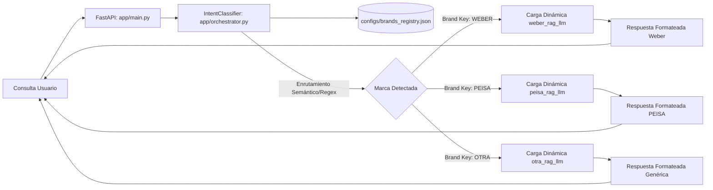

# Documentación de Cambios: Versión 5.0.0

Este documento detalla la refactorización realizada en el sistema del Asistente Técnico unificado de **SOLDASUR** para dar soporte a un **Registro Centralizado y Dinámico de Marcas**.

---

## 1. Objetivos de la Refactorización

*   **Desacoplamiento:** Eliminar las dependencias de marca hardcodeadas en el código core del backend (`app/main.py` y `app/orchestrator.py`).
*   **Extensibilidad (Plug & Play):** Permitir que la incorporación de nuevas líneas de productos (por ejemplo, *Tigre*, *IPS*, *Sica*) se pueda hacer sin modificar el código base del servidor ni el clasificador de intenciones.
*   **Centralización:** Agrupar todos los metadatos heurísticos, anclas semánticas y configuraciones de enrutamiento en un único archivo de configuración JSON.

---

## 2. Nueva Arquitectura Dinámica

El sistema de enrutamiento y procesamiento ahora funciona de forma declarativa:

---

## 3. Resumen de Archivos Creados y Modificados

### [NEW] [brands_registry.json](file:///d:/ESTUDIO/CPMA/DEV/22%20-%20PRACTICA%20PROFESIONALIZANTE%20II/Repo/v5/SOLDASUR_PP2_1C_2026/configs/brands_registry.json)
Contiene la configuración de palabras clave heurísticas, textos ancla semánticos y punteros a los módulos python de RAG correspondientes a las marcas activas.

### [MODIFY] [orchestrator.py](file:///d:/ESTUDIO/CPMA/DEV/22%20-%20PRACTICA%20PROFESIONALIZANTE%20II/Repo/v5/SOLDASUR_PP2_1C_2026/app/orchestrator.py)
*   **Carga del Registro:** Lee y parsea `brands_registry.json` durante el `__init__`.
*   **Embeddings Dinámicos:** Genera los vectores de similitud de textos ancla en bucle iterando sobre las marcas declaradas en el JSON.
*   **Clasificación Híbrida Dinámica:**
    *   *Contextual:* Evalúa si `last_active_brand` coincide con alguna marca del registro y si no hay palabras clave de conflicto.
    *   *Heurística:* Evalúa coincidencias regex contra los listados de `direct_keywords` de cada marca.
    *   *Semántica:* Calcula la similitud de coseno contra todos los vectores ancla mapeados y selecciona la marca de mayor puntuación (siempre que supere el umbral de `0.35`).

### [MODIFY] [main.py](file:///d:/ESTUDIO/CPMA/DEV/22%20-%20PRACTICA%20PROFESIONALIZANTE%20II/Repo/v5/SOLDASUR_PP2_1C_2026/app/main.py)
*   **Endpoint `/api/chat`:**
    *   Obtiene la clave de la marca ganadora (`brand_key`) del análisis de intención.
    *   Carga dinámicamente el módulo RAG configurado en el JSON mediante `importlib.import_module`.
    *   Evalúa el `"response_formatter"` en la configuración de la marca:
        *   `weber`: Ejecuta el flujo autogestionado con soporte de cálculo de rendimiento por m².
        *   `peisa`: Ejecuta el flujo tradicional con inyección de producto activo y búsqueda externa de productos.
        *   `generic`: Fallback seguro para cualquier marca nueva que exponge una API básica de consulta.

---

## 4. Pruebas de Correctitud Realizadas

Se ejecutó un script de verificación automatizado en el entorno local (`scratch/test_orchestrator.py`) con los siguientes resultados:

1.  **Consulta Neutra/Saludo:** `"hola"` -> Similitudes semánticas por debajo de `0.35` -> Deriva a `IntentType.HYBRID` sin clave de marca. (Correcto).
2.  **Consulta Rápida Weber:** `"necesito un impermeabilizante weber"` -> Clasifica instantáneamente como `IntentType.WEBER_QUERY` por heurística directa. (Correcto).
3.  **Consulta Rápida PEISA:** `"quiero una caldera peisa"` -> Clasifica instantáneamente como `IntentType.FREE_QUERY` (RAG PEISA) por heurística directa. (Correcto).
4.  **Similitud Semántica Weber:** `"pegamento para porcellanato"` -> Coincidencia semántica con ancla Weber (`0.363 > 0.35` y mayor a PEISA) -> Deriva a `IntentType.WEBER_QUERY` con clave `WEBER`. (Correcto).
5.  **Similitud Semántica PEISA:** `"qué radiador me recomiendan"` -> Coincidencia semántica con ancla PEISA (`1.00`) -> Deriva a `IntentType.FREE_QUERY` con clave `PEISA`. (Correcto).
6.  **Contextual de Seguimiento:** `"colores disponibles"` con contexto `last_active_brand: WEBER` -> Mantiene contexto y clasifica como `IntentType.WEBER_QUERY`. (Correcto).
